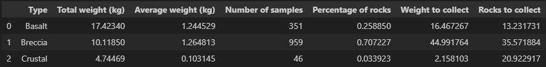
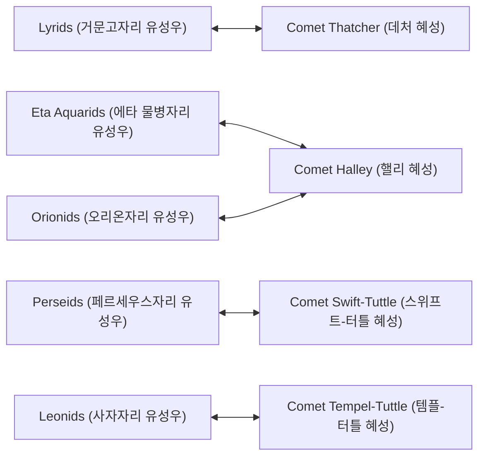
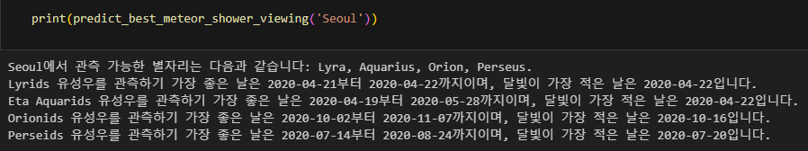
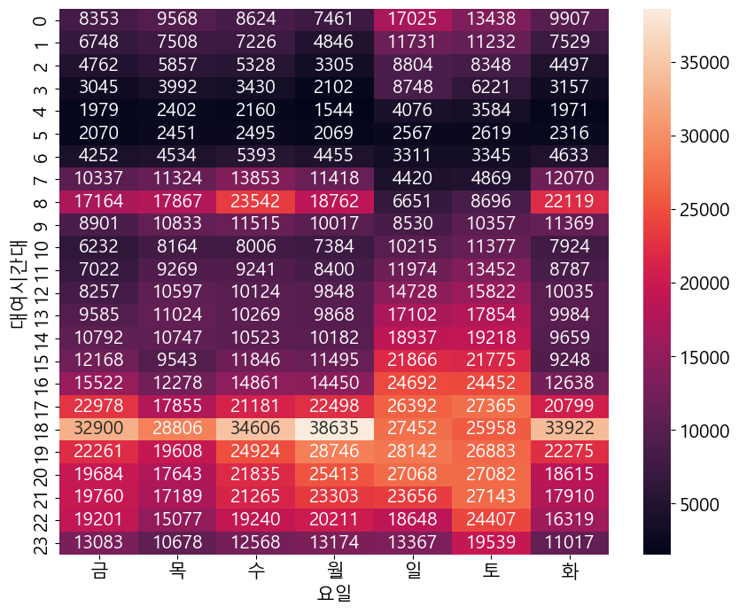
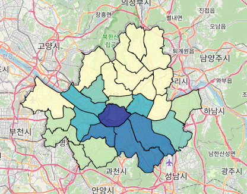
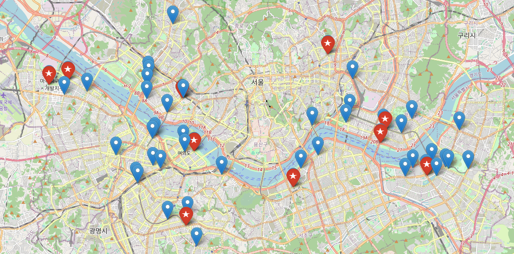

# 파이썬 기본문법
## Python 특성
> 플랫폼 독립성: 동일한 코드를 윈도우, 맥, 리눅스 등 다양한 운영체제에서 실행가능  
> 동적 타이핑  
> 객체지향, 절차적 함수형 프로그래밍  
> 인터프리터 언어: 컴파일 과정 없이 코드를 바로 실행 가능 -> 개발 주기 빠름  
> 쉬운 확장성: C/C++, java등 다른 언어와의 통합 용이  
> 변수는 값을 가리키는 이름, 변수에 값이 할당될때 그 값의 데이터 형에 따라 변수 타입이 결정된다.  
> 변수 이름은 영문, 숫자, _(underbar기호)로 만들 수 있고 숫자로 시작할 수 없고, 영문의 대, 소문자를 구별한다.  

## 자료형
| 자료형    | 설명                        |
|:----------:|:----------------------------|
| `int()`  | 정수형, 소수점이 없는 수    |
| `float()`| 실수형, 소수점이 있는 수    |
| `str()`  | 문자열형, 하나 또는 다수의 문자로 구성 |
| `bool()` | 논리형, `True` 또는 `False` |

## 연산자
| 연산자  | 설명         |
|:--------:|:------------|
| `+`  | 더하기      |
| `-`  | 빼기        |
| `*`  | 곱하기      |
| `/`  | 나누기      |
| `%`  | 나머지      |
| `//` | 몫         |
| `**` | 거듭제곱    |
| `==` | 같다       |
| `!=` | 같지 않다  |
| `<`  | 작다       |
| `>`  | 크다       |
| `<=` | 작거나 같다 |
| `>=` | 크거나 같다 |
| `and` | 모두 참일때 참 |
| `or` | 모두 거짓일때 거짓 / 둘중 하나라도 참이면 참 |
| `not` | 참이면 거짓, 거짓이면 참 |

## 문자열 인덱싱 및 슬라이싱
|**문자열**| <span style="font-size:18px;">L</span> | <span style="font-size:18px;">i</span> | <span style="font-size:18px;">f</span> | <span style="font-size:18px;">e</span> | &nbsp; | <span style="font-size:18px;">i</span> | <span style="font-size:18px;">s</span> | &nbsp; | <span style="font-size:18px;">t</span> | <span style="font-size:18px;">o</span> | <span style="font-size:18px;">o</span> | &nbsp; | <span style="font-size:18px;">s</span> | <span style="font-size:18px;">h</span> | <span style="font-size:18px;">o</span> | <span style="font-size:18px;">r</span> | <span style="font-size:18px;">t</span> | <span style="font-size:18px;">,</span> |
|:------------:|:----:|:----:|:----:|:----:|:------:|:----:|:----:|:------:|:----:|:----:|:----:|:------:|:----:|:----:|:----:|:----:|:----:|:----:|
|**인덱스**|0|1|2|3|4|5|6|7||8|9|10|11|12|13|14|15|16|17|  
|**음의 인덱스**|-18|-17|-16|-15|-14|-13|-12|-11|-10|-9|-8|-7|-6|-5|-4|-3|-2|-1|  
  
"Life" 슬라이싱 = s[0:4], s[:4], s[-18:-14]

## print() 함수
**`print(값, ...,[sep=''], [end=''])`**  
값: 출력 대상  
sep: 출력 대상들 사이에 넣을 구분 기호 지정, 기본값은 공백  
end: 값 출력하고 마지막에 출력할 문자열 지정, 기본값은 줄바꿈  

## Escape Sequence
| 이스케이프 시퀀스 | 표현 내용 |
|:--------:|:------------:|
| `\n`  | 새로운 줄 츨력 |
| `\t`  | tab 출력 |
| `\'`  | 작은따움표 출력 |
| `\"`  | 큰따움표 출력 |
| `\\`  | \ 문자 출력 |
| `\v`  | 수직 탭 출력 |
| `\a`  | 경보 문자 출력 |
| `\b`  | 백스스페이스 출력 |

## 반복문
| while | for | while True |
|:-----:|:---:|:----------:|
| 조건 반복 | 횟수 반복 | 무한 반복 |

## 컬렉션 자료형
| 컬렉션 | 생성 방법 | 순서 유지 | 변경 가능 | 중복 허용 | 주요 특징 |
|:--------:|:----------:|:----------:|:----------:|:----------:|:--------------------------------:|
| **리스트 (list)** | [ ] | ✅ | ✅ | ✅ | 배열과 유사, 빠른 접근 가능 |
| **튜플 (tuple)** | ( ) | ✅ | ❌ | ✅ | 읽기 전용, 불변(Immutable) |
| **세트 (set)** | { } | ❌ | ✅ | ❌ | 중복 제거, 집합 연산 지원 |
| **딕셔너리 (dict)** | {키:값} |✅ (Python 3.7+) | ✅ | ❌(키) / ✅(값) | 키-값 쌍 저장, 빠른 조회 |

## 내장함수
> **`map(function, iterable, ...)`**  
    function: 각 요소에 적용할 함수  
    iterable: 반복 가능한 자료형  
    ...: 다수의 iterable을 전달할 수도 있음  
```python
def square(n):
    return n * n

numbers = [1, 2, 3, 4, 5]
squared = map(square, numbers)

print(list(squared))  # [1, 4, 9, 16, 25]
```  

> **`zip(iterable1, iterable2, ...)`**  
    iterable1, iterable2, ...: 반복 가능한 자료형  
```python
a = [1, 2, 3]
b = ['a', 'b', 'c']
c = [True, False, True]

zipped = zip(a, b, c)
print(list(zipped))  # [(1, 'a', True), (2, 'b', False), (3, 'c', True)]
```

> **`enumerate(iterable, start=0)`**  
    iterable: 반복 가능한 객체  
    start: 인덱스의 시작 값(기본값은 0)  
    반환값: (인덱스, 값) 형태의 iterator  
```python
fruits = ['apple', 'banana', 'cherry']
enumerated_fruits = list(enumerate(fruits))

print(enumerated_fruits)  
# [(0, 'apple'), (1, 'banana'), (2, 'cherry')]
```

> **`filter(funtion, iterable)`**  
    funtion: 각 요소에 대해 True 또는 False를 반환하는 함수  
    iterable: 필터링할 반복 가능한 객체  
    반환값: True를 반환하는 요소들만 포함하는 itrator  
```python
def is_even(n):
    return n % 2 == 0

numbers = [1, 2, 3, 4, 5, 6]
filtered = filter(is_even, numbers)

print(list(filtered))  # [2, 4, 6]
```

## 데이터 분석의 5단계


## Over the Moon : 아르테미스 달탐사 데이터 분석
> Over the Moon은 페이페이라는 소녀가 달의 여신 항아를 만나기 위해 로켓을 만들어 모험을 떠나는 아름다운 이야기의 영화다.  
> - 암석 샘플 데이터 : https://curator.jsc.nasa.gov/lunar/samplecatalog/index.cfm  
> - 달 탐사 / 유성우 학습 모듈 데이터 : https://github.com/drguthals/learnwithdrg/tree/main/OverTheMoon  
> - 달 탐사선 중량 데이터 : https://nssdc.gsfc.nasa.gov/nmc/spacecraft/display.action?id=1969-059C  
> - 승무원 영역(Crewed Area) : 달 모듈(Lunar Module) + 명령 모듈(Command Module)  
> - 달 모듈(Lunar Module) : 달 궤도에 도달한 후 명령 모듈에서 분리되는 모듈로서 달 표면에 착률하고 우주 비생하스를 수송한다.
> - 명령 모듈(Command Module) : 우주 비행사가 생활하는 모듈로서 우주 비행사와 수집된 암석 샘플이 모듈에 실려 지구로 귀환한다.  
> - Payload : 로켓 안에 실리는 물건의 하중(우주선 안에 실리는 물건으로 화물, 승무원, 과학 장비, 실험 장치 등 즉, 승무원 영역은 페이로드에 속함)  

> - 아르테미스 임무에서 고려할 사항  
    1. 아르테미스 임무에 사용할 **우주선의 전체 사양을 모른다.**
    2. NASA Factsheet on the Space Launch System(SLS)와 Orion Modules의 일부 정보를 사용하여 **아르테미스 달탐사의 예상 승무원 영역값과 예상 페이로드 값을 수집**하고 **아폴로 달탐사 데이터 분석에서 얻은 비율을 사용한다.**
    3. 페이로드는 로켓이 대기권을 통과하여 우주로 나갈 수 있는 총중량을 말하며 이것이 각 모듈의 정확한 중량보다 더 정확할 수 있다.
    4. 아폴로 임무에 사용된 **Saturn V 페이로드**는 43,500Kg이고 모듈 중량은 임무마다 달랐다.
    5. **아르테미스 임무와 관련한 예측에 사용할 비율을 결정**하기 위해 아폴로 임무에 사용된 Saturn V 페이로드, 아폴로 각 임무의 암석샘를 중량, 모듈 중량, 승무원 영역 중량 데이터를 사용하겠다.

> - 아르테미스 우주 비행사가 최종 수집할 암석 종류와 개수  
  
    최종적으로 중량을 고려하여 Basalt 13개, Breccia 35개, Crustal 20개까지 수집이 가능하다.  

## Over the Moon : 아르테미스 유성우 데이터 분석  
> - 유성우(Meteor Shower) : 지구가 공전하며 유성체 흐름을 지나갈 때 많은 양의 유성이 떨어지는 유성우 발생(지구의 공전에 의해 매년 특정 시기에 특정 유성우 발생)  
> - 유성체 흐름(Meteoroid Stream) : 유성체가 혜성에서 떨어져 나올 때 혜성의 속도와 차이가 발생(유성체들은 혜성의 공전 궤도를 따라 띠를 형성)  
> - 유성우는 한 지점에서 시작해서 사방으로 퍼져 나가는 형태로 관측(복사점(radiant) 근처에서 위치한 별자리 이름을 유성우의 이름을 사용)  
> - 유성우는 관측자의 위치, 관측 시기, 관츨 날짜의 달의 위상 등에 따라 유성우를 볼 수 있는 지의 여부가 달라집니다.  

> - 4개의 혜성에서 발생하는 주요 5대 유성우에 집중


> - 달의 위상(Moon phases) : 유성우를 볼 수 있는 기간 중 달빛이 밝지 않은 날짜를 고려
> - 위도(Latitude) : 관측자가 위차한 도시의 실제 위도 정보를 고려
> - 항아의 유성우  
    Over the Moon 영화 속에서 페이페이는 추석 후에 달로 여행을 떠나는데 추석 시기에 볼 수 있는 유성우를 가상의 항아 유성우로 적용하여 데이터프레임에 추가  
    Over the Moon 영화의 배동 도시인 중국 Beijing을 입력하여 결과를 확인  
      

**최종 목표는 유성우를 가장 관찰할 수 있는 날짜를 예측하는 코드 작성**  

  

## 따릉이 자전거 데이터 분석 및 시각화
> - 주요 토픽  
    1. 시간개념에 따른 이용 패턴 : 언제 많이 타는지와 한번 대여하면 어느 정도의 시간을 대여하는지에 대한 분석  
    2. 장소적 특징에 따른 이용패턴 : 대여소가 위차한 장소적 특징에 따라서 사용자의 이용패턴  
    3. 시간 개념 X 장소적 특징에 따른 이용패턴 : 시간 개념과 대여소가 위차한 장소적 특징을 모두 고려하여 사용자의 이용 패턴을 분석  
> - 따릉이 데이터 : https://data.seoul.go.kr  
> - 대여시간대 X 요일이용건수 히트맵그래프    
      
    **17~19시 퇴근시간 대에 따릉이를 많이 이용**  
> - 구간별 따릉이 이용시간 평균 지도 표시  
      
    **서울시 용산구에서 가장 많이 이용**  
> - 인기 있는 대여소 TOP50(주말, 파란색), TOP10(평일, 빨간색)  
      