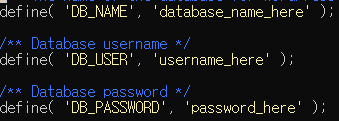

# Azure Cloud Computing & VM wordpress
## Cloud Computing  
> - 인터넷을 통해서 원격으로 서버, 스토리지, 데이터베이스, 소프트웨어, 네트워크 등 다양한 컴퓨터 서비스를 원할 때 사용하는 것을 말합니다.  
> - 사용자가 필요한 리소스와 서비스에 대해 필요한 만큼만 지불하면서 이를 액세스하고 사용할 수 있음  

## Cloud Service type  
| 구성 요소            | On-Premises | Colocation | Hosting | IaaS          | PaaS          | SaaS          |
|---------------------|:-----------:|:----------:|:--------:|:--------------:|:---------------:|:---------------:|
| Data                | 사용자       | 사용자       | 사용자   | 사용자         | 사용자         | 사용자         |
| Application         | 사용자       | 사용자       | 사용자   | 사용자         | 사용자         |               |
| Databases           | 사용자       | 사용자       | 사용자   | 사용자         | 사용자         |                |
| Operating Systems   | 사용자       | 사용자       | 사용자   | 사용자         |                |               |
| Virtualization      | 사용자       | 사용자       |          |               |                |               |
| Physical Servers    | 사용자       |              |         |               |                 |               |
| Network & Storage   | 사용자       |              |         |               |                 |               |
| Data Center         | 사용자       |              |         |               |                 |               |

IaaS : Infrastructure as a Service  
PaaS : Platform as a Service  
SaaS : Software as a Service  

## Azure Status
> - https://azure.status.microsoft/  

## WordPress  
> - 워드프레스란 대표적인 웹 콘텐츠 관리 시스템으로 개인들도 손쉽게 웹 사이트를 구축할 수 있는 도구  

## CLI로 리소스 그룹, VM 만들기
az login  
az group create --name '리소스그룹명' --location koreacentral  

az vm create --resource-group "리소스그룹명' --name "VM 리소스명" --image Canonial:ubuntu-24_04-lts:server:24.04.202408210 --admin-username azureuser --generate-ssh-keys

## Linux 기본명령어  
> - ls 
**LiSt**의 약자(명령 프롬프트의 dir 명령과 같은 역할)  
ls      -> 현재 디렉터리의 파일 목록을 표시  
ls -a   -> 현재 디렉터리의 목록(숨김 파일 포함)을 표시  
ls -l   -> 현재 디렉터리의 목록을 자세히 표시  

> - cd
**Change Directory**의 약자  
cd      -> 현재 사용자의 홈 디렉터리로 이동  
cd ..   -> 상위의 디렉터리로 이동  

> - rm
**ReMove**의 약자  
rm abc.txt  -> 해당 파일을 삭제  
rm -r abc/  -> abc 디렉토리 안에 있는 파일/하위 디렉터리 전부 삭제  
rm -rf abc/ -> abc 디렉토리 안에 있는 파일/하위 디렉터리 전부 경고 없이 삭제  

> - mv  
**MoVe**의 약자  
mv abc.txt /etc/samples/    -> abc.txt를 /etc/samples/ 디렉터리로 이동  
mv abc.txt cba.txt          -> abc.txt의 이름을 cba.txt로 변경  

> - mkdir
**Make DIRectory**의 약자  
mkdir abc               -> 현재 디렉터리에 /abc 이름의 디렉터리 생성  
mkdir -p /etc/samples/  -> /etc/samples/ 디렉터리 생성(/etc 디렉터리가 없어도 자동생성)  

> - rmdir  
**ReMove DIRectory**의 약자  
rmdir abc   -> /abc 디렉터리를 삭제  

## VM 원시 SSH로 워드프레스 설치
- https://cloudinfrastructureservices.co.uk/how-to-install-wordpress-on-ubuntu-22-04-using-lamp/   

ssh -i <YOUR_PRIVATE_KEY_PATH> azureuser@<PUBLIC_IP_ADDRESS>  
Are you sure you want to continue connecting (yes/no/[fingerprint])?  
yes  
- ssh : **Secure SHell**로 보안되지 않는 네트워크를 통해 컴퓨터 간의 안전한 통신을 가능하게 하는 암호화 네트워크 프로토콜  

sudo apt update -y  
- sudo : **SuperUser DO**로 관리자 권한으로 이 명령을 실행하라는 뜻  

sudo apt upgrade -y  
sudo apt install apache2 mariadb-server php php-curl php-gd php-mbstring php-xml php-xmlrpc php-soap libapache2-mod-php php-mysql -y  
sudo systemctl start apache2  
sudo systemctl enable apache2  

> sudo mysql_secure_installation  

    Enter current password for root (enter for none): Enter  
    Switch to unix_socket authentication: n​  
    Change the root password?: y​  
    New password: ‘비밀번호’ 입력​  
    Re-enter new password: ‘비밀번호’ 다시 입력  
    Remove anonymous users?: y  
    Disallow root login remotely?: y  
    Remove test database and access to it?: y  
    Reload privilege tables now?: y  
    Thanks for using MariaDB! 출력되면 정상  

> sudo mysql -u root -p  
    Enter password: 비밀번호 입력  
    MariaDB [(none)]> CREATE DATABASE wordpress;​  
    MariaDB [(none)]> CREATE USER 'wordpress'@'localhost' IDENTIFIED BY '비밀번호';​  
    MariaDB [(none)]> GRANT ALL PRIVILEGES ON wordpress.* TO 'wordpress'@'localhost';​  
    MariaDB [(none)]> FLUSH PRIVILEGES;​  
    MariaDB [(none)]> EXIT;  

cd /var/www  
sudo rm -rf *  
sudo wget http://wordpress.org/latest.tar.gz  
sudo tar -xvzf latest.tar.gz  
sudo rm latest.tar.gz  
sudo mv wordpress html  
cd html  
sudo mv wp-config-sample.php wp-config.php  
sudo nano wp-config.php  
- nano : GNU nano로 리눅스 터미널 기반의 텍스트 에디터  
  
database_here, username_here, password_here 부분 수정  

sudo chown -R www-data:www-data /var/www/html  
sudo chmod -R 775 /var/www/html  

> sudo nano /etc/apache2/sites-available/wordpress.conf  

    <VirtualHost *:80>

        ServerAdmin <Your_Email>
        DocumentRoot /var/www/html
        ServerName <PUBLIC_IP_ADDRESS>

        <Directory /var/www/html/>
            Options FollowSymLinks
            AllowOverride All
            Require all granted
        </Directory>

        ErrorLog ${APACHE_LOG_DIR}/yourdomain_error.log
        CustomLog ${APACHE_LOG_DIR}/yourdomain_access.log combined

    </VirtualHost>  
해당 텍스트가 VS code나 다른 에디터를 통해서 안보이는 특수문자가 생기므로 직접 타이핑을 하시던가, GPT를 이용하면 쉽게 해결 가능함  

cd /etc/apache2/sites-available/  
sudo a2ensite wordpress.conf  
sudo a2enmod rewrite  
sudo systemctl restart apache2  

<PUBLIC_IP_ADDRESS> 접속