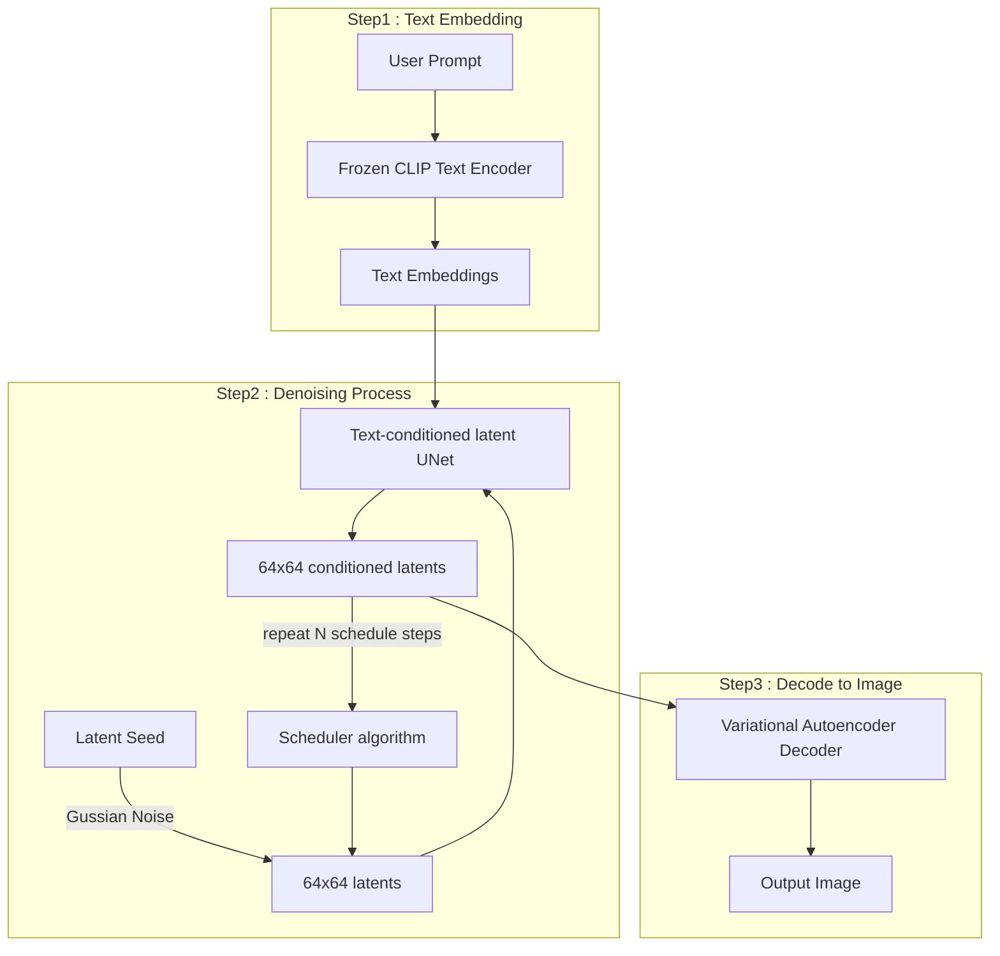

# Stable Diffusion  

## Image Generation  
> - 대표적인 생성 기술인 GAN(Generative Adversarial Networks : 적대적 생성 신경망)은 이미지를 만드는 생성자(generator)와 진위 여부를 판단하는 구별자(discriminator)로 구성  
> - 위 두 시스템이 피드백 루프에서 서로 경쟁을 하면서 생성자는 구별자가 진위 여부를 판별할 수 없을 때까지 학습하며 더 좋은 이미지를 생성  
> - GAN 외에도 VAE, Diffusion  
> - VAE(Variational AutoEncoder) : 잠재 공간에서 샘플링하여 새로운 데이터를 생성하거나 변형하는 모델  
> - 확산 모델(Diffusion Probabilistic Model) : 학습 데이터에 지속적으로 잡음(noise)을 추가하여 손상 시킨 후 잡음을 제거해 가며 원상복구하는 방식의 생성 모델  
> - 오류 사례 : 손, 피아노 건반, 텍스트

## Audio Generation  
> - 음성/소리 분야에 WaveGAN 기술이 적용  
> - Tacotron2 와 같은 TTS는 텍스트를 입력 받아 음성 생성  

## Video Generation  
> - Video diffusion model 등을 이용하여 비디오 생성  
> - 텍스트 설명을 통해서 장면을 생성하거나 특정 비디오에서 누락 또는 손상된 프레임을 예측하여 보충   

## Stable Diffusion  
> - Stable Diffusion 기본구조  

Step 1 : 입력받은 Prompt는 CLIP Text Encoder를 통해 단어와 이미지가 서로 어떤 의미에서 가까운지 정렬된 벡터(숫자)로 전환해 UNet으로 전달  
Step 2 : Latent Seed(랜덤 노이즈)를 생성하여 텍스 임베딩 조건으로 하여 UNet이 점점 노이즈를 제거하여 Scheduler를 통해 여러번 반복  
Step 3 : VAE를 통해 고해상도 이미지로 디코딩  

## Stable Diffusin 기능  
Outpainting : 이미지를 특정 방향으로 확장할때 사용하는 기능  
Upscaling : 좋은 품질의 이미지를 얻을 수 있음  
Inpainting : 생성된 이미지에서 마음에 안드는 부분이 있을 때 다시 그릴 수 있음  
ControlNet : 구도 및 피사체의 자세를 복제할 수 있는 신경망으로써 생성된 이미지에서 피사체의 위치, 모습 등을 제어 가능  
    - https://github.com/Mikubill/sd-webui-controlnet  
LoRA(Low-Rank Adaptation) : Stable Diffusion을 미세 조정하는 방법 중 하나  
Refiner : SDXL에서 사용하기 위해 개발됨, 단순히 두 개의 모델을 사용할 수 있는 장점 뿐만 아니라 목적에 맞게 만들어진 refiner 모델을 사용하면 SDXL의 성능 자체가 좋아짐  
    - civitdl 84040 . -k  
Sketch : img2img 탭 내에 있는 기능으로 손으로 그린 스케치를 이미지로 변환  
배경제거 : stable-dffiusion-webui-rembg 이미지 배경 제거 도구를 설치하여 Extension에서 사용 가능

# Stable Diffusion 설치 및 시작  
Azure Machine learning 생성  
computing instance 만들기(GPU)  

ssh -i <YOUR_PRIVATE_KEY_PATH> azureuser@<PUBLIC_IP_ADDRESS> -p 50000  
Are you sure you want to continue connecting (yes/no/[fingerprint])?  
yes  

git clone https://github.com/lllyasviel/stable-diffusion-webui-forge.git  
cd stable-diffusion-webui-forge  
conda create -n webui-forge python=3.10  
conda activate webui-forge  
cd ~/stable-diffusion-webui-forge/models/Stable-diffusion  

curl -H "Authorization: Bearer <HUGGINGFACE_TOKEN>" https://huggingface.co/runwayml/stable-diffusion-v1-5/resolve/main/v1-5-pruned-emaonly.ckpt --location --output v1-5-pruned-emaonly.ckpt  

curl -H "Authorization: Bearer <HUGGINGFACE_TOKEN>" https://huggingface.co/lllyasviel/flux1_dev/resolve/main/flux1-dev-fp8.safetensors --location --output flux1-dev-fp8.safetensors  

curl -H "Authorization: Bearer <HUGGINGFACE_TOKEN>" https://huggingface.co/black-forest-labs/FLUX.1-dev/resolve/main/ae.safetensors --location --output ae.safetensors  

curl -H "Authorization: Bearer <HUGGINGFACE_TOKEN>" https://huggingface.co/comfyanonymous/flux_text_encoders/resolve/main/clip_l.safetensors --location --output clip_l.safetensors  

mv ae.safetensors ../VAE  
mv clip_l.safetensors ../text_encoder  

sudo apt-get update  
sudo apt-get install libgoogle-perftools-dev -y  
pip install civitdl  
sudo apt-get install lynx w3m links -y  

cd ../../  
./webui.sh --share --enable-insecure-extension-access --gradio-auth <username:password>  

> - Lora 모델 설치  
https://civitai.com/  
cd ~/stable-diffusion-webui-forge/models/Lora  
civitdl model_id . -k  

cd ~/stable-diffusion-webui-forge/outputs/txt2img-images/<YYYYMM_DD>  
zip -r output.zip .  
exit;  
scp -i "<YOUR_PRIVATE_KEY_PATH>" -P 50000 azureuser@<PUBLIC_IP_ADDRESS>:":/home/azureuser/stable-diffusion-webui-forge/outputs/txt2img-images/<YYYY-MM-DD>/output.zip" "<YOUR_DOWNLOAD_PATH>"  