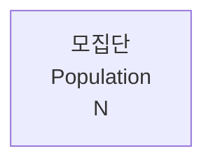

# 통계기반 데이터 활용

## Machine Learning Process

```mermaid
graph LR
    A["문제 정의"] --> B["데이터 수집 및 이해"]
    B --> C["데이터 준비"]
    C --> D["데이터 모델링"]
    D --> E["모델링 평가"]
```

## 통계 관련 용어 및 개념  
- 모집단과 표본  

```mermaid
graph LR
    A["모집단\nPopulation\nN"]
```