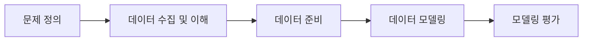
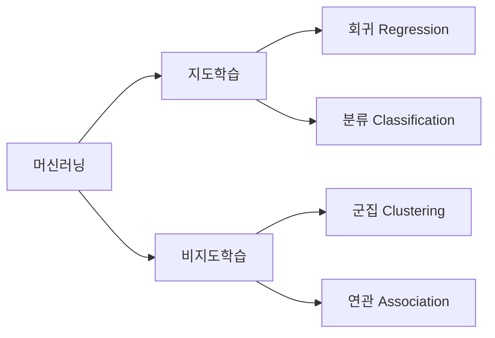
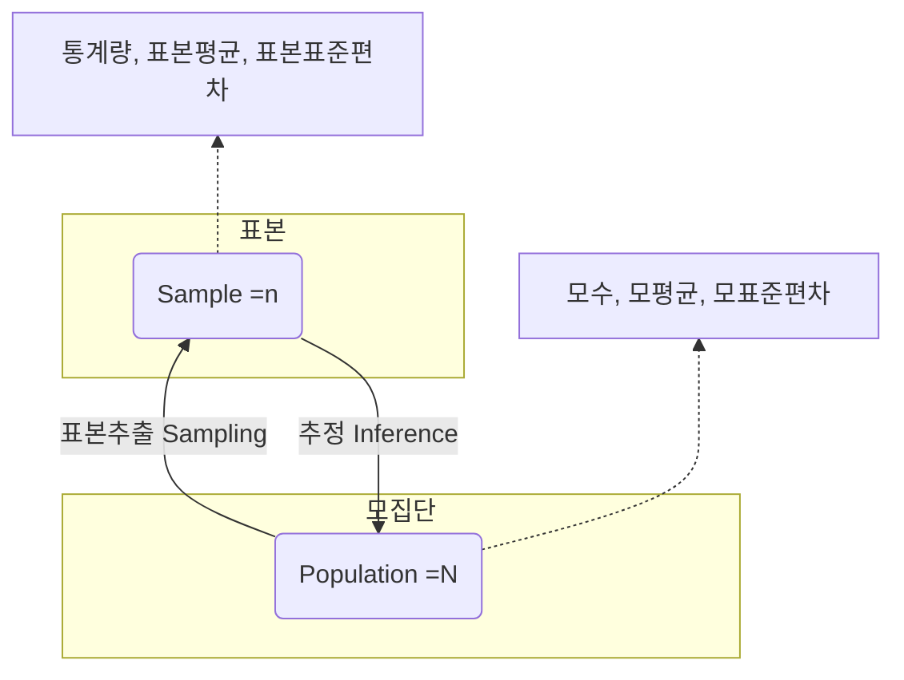
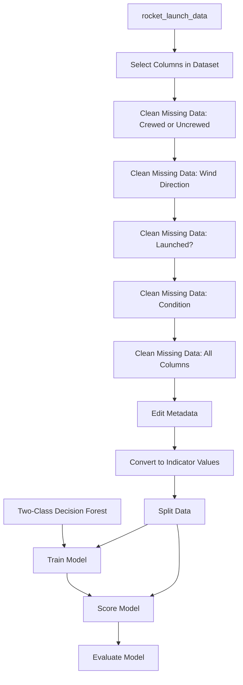
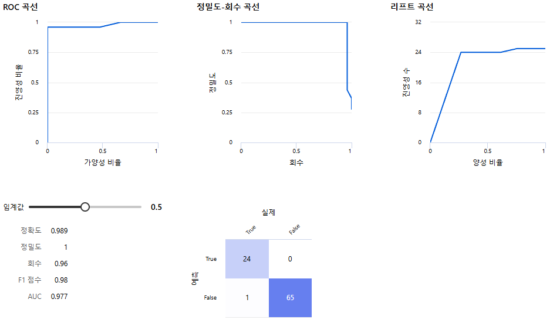
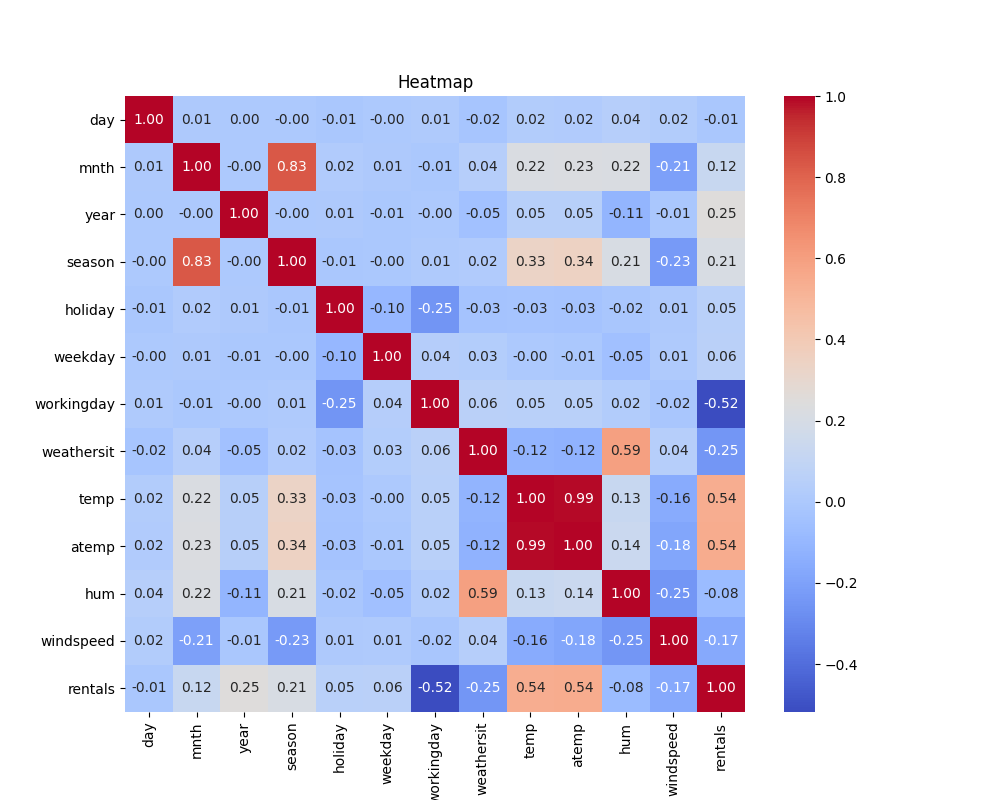
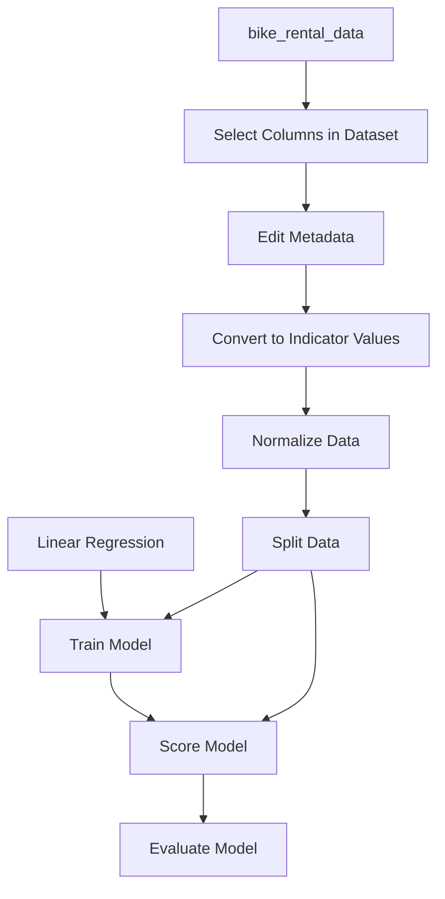
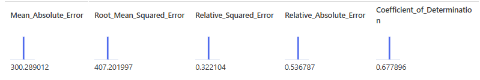

# 통계기반 데이터 활용

## Machine Learning Process

## Machine Learning Model Type  

## 통계 관련 용어 및 개념  
- 모집단과 표본  

- 평균(Mean) : 모든 값을 더한 후 데이터의 개수로 나눈 값 / 연속적이고 정규 분포를 따르는 데이터에서 대표값을 구할 때 유용  
- 중앙값(Median) : 표본 내의 원소들을 크기 순서대로 나열했을 때 중앙에 위치한 값 / 비대칭적이거나 이상치가 있을 때 사용  
- 최빈값(Mode) : 표본에서 가장 자주 나타는 값 / 범주형 데이터에서 빈도가 가장 높은 값을 찾을 때 유용  
- 가중평균(Weighted Mean) : 표본의 원소들의 값에 가중치를 부여하여 계산한 평균 / 모든 원소들의 값이 동일한 중요도를 가지지 않을 때 사용  
- 조화평균 (Harmonic Mean) : 원소들의 값들의 역수의 평균을 다시 역수로 변환하여 계산 / 주로 비율이나 속도 데이터에서 사용  
- 산포도(Measure of Dispersion) : 통계에서 산포도를 측정하는 방법들은 데이터의 변동성을 파악하는 데 중요한 역할을 함  
- 범위(Range) : 표본 집합에서 가장 큰 값과 가장 작은 값의 차이 / 단순해서 많이 사용되지만 극단값에 민감  
- 분산(Variance) : 데이터 값들이 평균에서 얼마나 떨어져 있는지를 나타냄  / 각 데이터 값에서 평균을 뺀 값을 제곱한 후, 이 값들의 평균  
- 표준편차(Standard Deviation) : 데이터가 평균에서 얼마나 떨어져 있는지에 대한 표준적인 거리 / 분산의 제곱근  
- 사분위수 범위(Interquartile Range, IQR) : 데이터의 중앙 50%가 포함된 범위 / Q3-Q1의 차이로 극단값의 영향을 덜 받음  
- 왜도(Skewness) : 분포의 비대칭성을 측정하는 지표  
- 첨도(Kurtosis) : 분포의 뾰족함과 꼬리의 두꺼움을 측정하는 지표  
- 신뢰구간(Confidence Interval) : 모수가 신뢰구간 안에 포함될 것으로 예상되는 범위  
- 신뢰수준(Confidence Level) : 모수가 신뢰구간에 포함될 확률  
- 상관계수(Correlation Coefficient) : 두 분수 간의 관계의 강도와 방향을 나타내는 수치  

## Azure ML Designer 활용하여 날씨 데이터를 통해 로켓 발사 예측 모델 구현  
> - Azure ML Studio 데이터에 ./iamge/RocketLaunchDataCompleted.csv 등록  
> - 로켓 발사 여부 결정에 영향을 미치는 요소 : 날씨 데이터(온도, 강수량, 풍향, 풍속, 번개, 구름 등)  
> - 모델링 유형 : 분류(Classification)(=예/아니오 등의 범주를 예측)  
> - 데이터의 이해  
>   - Name : 이름  
>   - Date : 날짜  
>   - Time : 시간  
>   - Location : 장소  
>   - Crewed / Uncrewed : 유무인  
>   - Launched : 발사 여부  
>   - High Temp : 최고 온도  
>   - Low Temp : 최저 온도  
>   - Ave Temp : 평균 온도  
>   - Temp at Launch : 발사 시 온도  
>   - Hist High Temp : 과거 최고 온도  
>   - Hist Low Temp : 과거 최저 온도  
>   - Hist Ave Temp : 과거 평균 온도  
>   - Precipitation : 발사 시 강수량  
>   - Hist Ave Precipitation : 과거 평균 강수량  
>   - Wind Direction : 풍향  
>   - Max Wind Speed : 최고 풍속  
>   - Wind Speed at Launch : 발사 시 풍속  
>   - Visibility : 가시성  
>   - Hist Ave Max Wind Speed : 과거 평균 최고 풍속  
>   - Hist Ave Visibility : 과거 평균 가시성  
>   - Fair : 맑음  
>   - Partly Cloudy : 약간 흐림  
>   - Mostly Cloudy : 많이 흐림  
>   - Cloudy : 흐림  
>   - T-storm : 천둥 번개  
>   - Sea Level Pressure : 해면기압  
>   - Hist Ave Sea Level Pressure : 과거 평균 해면기압  
>   - Day Length : 낮의 길이  

> - Azure ML Designer 흐름도 및 구성요소에 대한 설명

> - rocket_lannch_data : 원본데이터셋  
> - Select Columns in Dataset : 해당된 컬럼만 사용  
>   - Columns : Name, Date, Time, Location, Hist Ave Max Wind Speed, Hist Ave Visibility, Sea Level Pressure, Hist Ave Sea Level Pressure, Day Length ,Note 제거  
> - Clean Missing Data : 누락된 데이터(null)가 있을 때 자동으로 값을 채우거나, 샘플을 제거하거나, 지정한 값으로 대체하는 전처리  
>   - Crewed or Uncrewed : Replacement value == Uncrewed  
>   - Wind Direction : Replacement value == Unknown  
>   - Launched? : Replacement value == False  
>   - Condition : Replacement value == Fair  
>   - All Columns : Replacement value == 0  
> - Edit Metadata : 수치값이지만 순서나 크기의 의미가 없기에 범주형으로 처리
>   - Data type == String  
>   - Categorical == Categorical  
>   - Fields == Features  
>   - Columns : Crewed or Uncrewed,Wind Direction,Condition  
> - Convert to Indicator Values : 범주형 칼럼를 숫자 벡터로 변환(One-Hot Encoding, 범주형 변수의 잘못된 수치적 해석을 방지)  
>   - Columns : Crewed or Uncrewed,Wind Direction,Condition  
>   - Overwrite categorical columns == True
> - Split Data : 데이터셋을 train : test = 7 : 3 으로 나눔  
>   - Fraction of rows in the first output dataset == 0.7  
> - Two-Class Decision Forest : 이진 분류 문제용 앙상블(조화) 모델  
>   - Maximum depth of the decision trees == 5(질문을 몇 단계까지 할 수 있는지 제한, 너무 깊으면 복잡하고 Overfitting됨)  
> - Train Model : 위에서 선택한 모델을 가지고 앞서 분할한 학습 데이터를 사용해서 모델을 학습  
>   - Label column : Launched?  
> - Score Model : 테스트 데이터에 대해 예측 수행  
> - Evaluate Model : 모델 성능 평가 지표를 출력  

## Azure ML Designer 활용하여 날씨 데이터를 통해 로켓 발사 예측 모델 Overview  
  
1. ROC 곡선  
    - 분류 임계값을 변화시킬 때 진양성비율(True Positive Rate)와 가양성비율(False Positive Rate)이 어떻게 바뀌는지를 보여줌  
    - 1에 가까울수록 좋음  

2. 정밀도-재현율 곡선  
    - 정밀도(Precision)은 양성이라고 예측한 것 중 실제 양성의 비율 / 재현율(Recall)은 실제 양성 중 양성으로 예측한 비율  
    - 임계값이 낮아지면 recall은 올라가지만 precision은 떨어지고, 그 반대도 마찬가지  

3. 리프트 곡선  
    - Lift는 예측 모델이 무작위 선택보다 얼마나 더 좋은 성능을 내는지 나타냄  
    - Lift = Precision / (Positive rate in dataset)  

4. 혼동 행렬(Confusion Matrix)  
    - 모델이 극히 보수적으로 양성 클래스를 예측하지만, 예측한 것 중에서는 전부 정확하다는 것을 의미한다. 단, 한 건의 실제 양성을 놓쳤지만 그 외엔 모두 적중  

## Azure ML Designer 활용하여 자전거 렌털 수요 예측 모델 구현  
> - Azure ML Studio 데이터에 ./iamge/03_daily-bike-share_Elixirr.csv 등록  
> - 자전거 수요에 영향을 미치는 요소 : 날씨, 계절, 휴일/평일  
> - 모델링 유형 : 회귀(Regression)(=옛날의 대표적인 자리(평균)로 돌아간다 / 예측한 선으로 오차가 회귀하도록 만들어진 모델)   
> - 데이터의 이해  
>   - day – 관찰이 이루어진 날짜  
>   - mnth – 관찰이 이루어진 월  
>   - year – 관찰이 이루어진 년도  
>   - season – 계절 (1: 겨울. 2: 봄, 3: 여름, 4: 가을)  
>   - holiday – 공휴일 여부 (1:공휴일, 0: 공휴일아님)  
>   - weekday – 요일 (0:일, 1:월, 2:화, 3:수, …, 6:토)  
>   - workinday – 근무일 여부 (1:근무일, 0:근무일 아님)   
>   - temp, atemp – 온도와 체감 온도  
>   - hum - 습도  
>   - windspeed – 바람의 세기  
>   - rentals – 자전거 대여수 – 라벨(타겟)  
>   - weathersit – 날씨 상황
>       - 1: Clear, Few clouds, Partly cloudy  
>       - 2: Mist+Cloudy, Mist+Broken clouds, Mist+Few clouds  
>       - 3: Light Snow, Light Rain+Thunderstorm...  
>       - 4: Heavy Rain+Ice Pallets+Thunderstorm+Mist, Snow+Fog  

> - Bike_rental_hitmap  
  
>       해당 이미지는 상관계수를 의미함  
>       마지막 행의 rental 수치를 보며 0에 가까울수록 영향이 없으며, 0에서 멀어질수록 영향이 있다는걸 뜻함  

> - Azure ML Designer 흐름도 및 구성요소에 대한 설명  

> - bike_rental_data  
> - Select Columns in Dataset  
>   - Columns : mnth,season,holiday,weekday,workingday,weathersit,temp,atemp,hum,windspeed,rentals 추가  
> - Edit Metadata  
>   - Data type == Integer  
>   - Categorical == Categorical  
>   - Fields == Features  
>   - Columns : mnth, season, holiday, weekday, workingday, weathersit  
> - Convert to Indicator Values  
>   - Columns : mnth, season, holiday, weekday, workingday, weathersit  
> - Normalize Data : 정규화 과정으로 모든 변수에 공정하게 가중치를 주어 비교하고 학습할 수 있도록 숫자의 범위를 0~1 로 맞춤  
>   - Transformation method == Zscore  
>   - Columns : temp, atemp, hum, windspeed  
> - Split Data  
>   - Fraction of rows in the first output dataset == 0.7  
> - Linear Regression : 선형 회귀 모델  
>   - Solution method == Online Gradient Descent(데이터를 한 번에 전체 학습하지 않고 조금씩 읽으며 반복적으로 학습하는 방식)  
> - Train Model : 위에서 선택한 Linear Regression 모델을 가지고 앞서 분할한 학습 데이터를 사용해서 모델을 학습  
>   - Label column : rentals  
> - Score Model  
> - Evaluate Model  

## Azure ML Designer 활용하여 자전거 렌털 수요 예측 모델 Overview  
  
1. 평균 절대 오차(MAE, Mean Absolute Error) = 300.29
    - 예측값과 실제값 사이의 차이를 절댓값으로 계산해서 평균 낸 것  
    - 평균적으로 모델은 예측에서 약 300건 정도 오차를 내고 있다는 뜻  
  
2. 제곱 평균 오차의 제곱근(RMSE, Root Mean Squared Error) = 407.20  
    - 오차를 제곱해서 평균 내고, 다시 제곱근을 씌운 값  
    - "오차의 평균 크기"를 말하지만, 큰 오차를 더 많이 벌점(penalty, 불이익)으로 줌  

3. 상대적 제곱 오차(RSE ,Relative Squared Error) = 0.322  
    - 예측 오차를 "항상 평균값으로 예측했을 때보다 얼마나 더 잘했는지"를 비율로 나타냄  
    - 내 모델의 오차 크기는 그냥 평균만 찍은 모델보다 약 32.2% 정도밖에 안 된다.(즉, 내 모델은 기본 모델보다 67.8%나 더 나은 성능을 보인다는 뜻)  

4. 상대적 절대 오차(RAE, Relative Absolute Error) = 0.536  
    - MAE와 같은 방식이지만, 비교 기준이 "모든 값의 평균값"  
    - 현재 모델은 평균값만 예측하는 것보다 약 46.4% 더 정확  

5. 결정계수(R², Coefficient of Determination) = 0.678  
    - 예측한 값이 실제값을 얼마나 잘 설명하는지 보여주는 지표  
    - 모델이 예측한 값이 실제 대여량 패턴의 67.8%를 설명  
