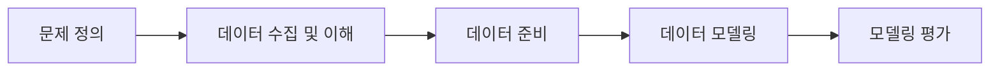
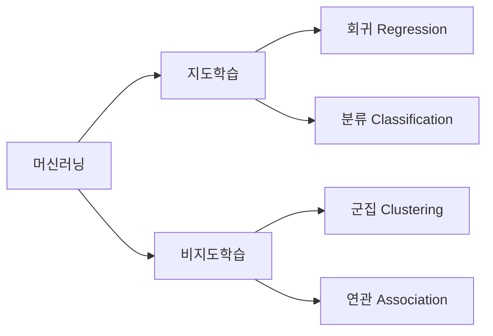
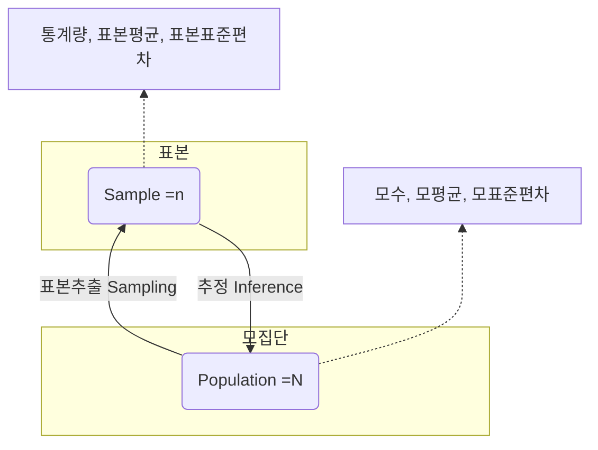
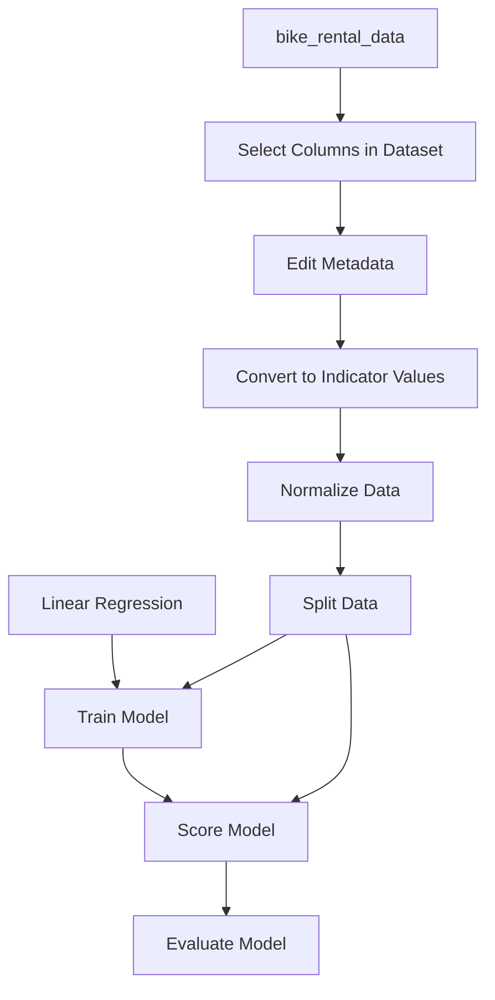

# 통계기반 데이터 활용

## Machine Learning Process

## Machine Learning Model Type  

## 통계 관련 용어 및 개념  
- 모집단과 표본  

- 평균(Mean) : 모든 값을 더한 후 데이터의 개수로 나눈 값 / 연속적이고 정규 분포를 따르는 데이터에서 대표값을 구할 때 유용  
- 중앙값(Median) : 표본 내의 원소들을 크기 순서대로 나열했을 때 중앙에 위치한 값 / 비대칭적이거나 이상치가 있을 때 사용  
- 최빈값(Mode) : 표본에서 가장 자주 나타는 값 / 범주형 데이터에서 빈도가 가장 높은 값을 찾을 때 유용  
- 가중평균(Weighted Mean) : 표본의 원소들의 값에 가중치를 부여하여 계산한 평균 / 모든 원소들의 값이 동일한 중요도를 가지지 않을 때 사용  
- 조화평균 (Harmonic Mean) : 원소들의 값들의 역수의 평균을 다시 역수로 변환하여 계산 / 주로 비율이나 속도 데이터에서 사용  
- 산포도(Measure of Dispersion) : 통계에서 산포도를 측정하는 방법들은 데이터의 변동성을 파악하는 데 중요한 역할을 함  
- 범위(Range) : 표본 집합에서 가장 큰 값과 가장 작은 값의 차이 / 단순해서 많이 사용되지만 극단값에 민감  
- 분산(Variance) : 데이터 값들이 평균에서 얼마나 떨어져 있는지를 나타냄  / 각 데이터 값에서 평균을 뺀 값을 제곱한 후, 이 값들의 평균  
- 표준편차(Standard Deviation) : 데이터가 평균에서 얼마나 떨어져 있는지에 대한 표준적인 거리 / 분산의 제곱근  
- 사분위수 범위(Interquartile Range, IQR) : 데이터의 중앙 50%가 포함된 범위 / Q3-Q1의 차이로 극단값의 영향을 덜 받음  
- 왜도(Skewness) : 분포의 비대칭성을 측정하는 지표  
- 첨도(Kurtosis) : 분포의 뾰족함과 꼬리의 두꺼움을 측정하는 지표  
- 신뢰구간(Confidence Interval) : 모수가 신뢰구간 안에 포함될 것으로 예상되는 범위  
- 신뢰수준(Confidence Level) : 모수가 신뢰구간에 포함될 확률  
- 상관계수(Correlation Coefficient) : 두 분수 간의 관계의 강도와 방향을 나타내는 수치  

## Azure ML Designer 활용하여 자전거 렌털 수요 예측 모델 구현  
> - 자전거 수요에 영향을 미치는 요소 : 날씨, 계절, 휴일/평일  
> - 모델링 유형 : 회귀(Regression)(=옛날의 대표적인 자리(평균)로 돌아간다 / 예측한 선으로 오차가 회귀하도록 만들어진 모델)  
>   - 경사하강법(Gradient Descent) : 비용함수를 사용하여 오차를 줄이는 방향으로 학습  
> - 데이터의 이해  
>   - day – 관찰이 이루어진 날짜  
>   - mnth – 관찰이 이루어진 월  
>   - year – 관찰이 이루어진 년도  
>   - season – 계절 (1: 겨울. 2: 봄, 3: 여름, 4: 가을)  
>   - holiday – 공휴일 여부 (1:공휴일, 0: 공휴일아님)  
>   - weekday – 요일 (0:일, 1:월, 2:화, 3:수, …, 6:토)  
>   - workinday – 근무일 여부 (1:근무일, 0:근무일 아님)   
>   - temp, atemp – 온도와 체감 온도  
>   - hum - 습도  
>   - windspeed – 바람의 세기  
>   - rentals – 자전거 대여수 – 라벨(타겟)  
>   - weathersit – 날씨 상황
>       - 1: Clear, Few clouds, Partly cloudy  
>       - 2: Mist+Cloudy, Mist+Broken clouds, Mist+Few clouds  
>       - 3: Light Snow, Light Rain+Thunderstorm...  
>       - 4: Heavy Rain+Ice Pallets+Thunderstorm+Mist, Snow+Fog  

> - Bike_rental_hitmap  
  
>       해당 이미지는 상관계수를 의미함  
>       마지막 행의 rental 수치를 보며 0에 가까울수록 영향이 없으며, 0에서 멀어질수록 영향이 있다는걸 뜻함  

> - Azure ML Designer 흐름도  

> - bike_rental_data : 원본데이터셋  
> - Select Columns in Dataset : 해당된 컬럼만 사용  
>   - Columns : mnth,season,holiday,weekday,workingday,weathersit,temp,atemp,hum,windspeed,rentals  
> - Edit Metadata : 수치값이지만 순서나 크기의 의미가 없기에 범주형으로 처리
>   - Data type == Integer  
>   - Categorical == Categorical  
>   - Fields == Features  
>   - Columns : mnth, season, holiday, weekday, workingday, weathersit  
> - Convert to Indicator Values : 범주형 칼럼를 숫자 벡터로 변환(One-Hot Encoding, 범주형 변수의 잘못된 수치적 해석을 방지)  
>   - Columns : mnth, season, holiday, weekday, workingday, weathersit  
> - Normalize Data : 정규화 과정으로 모든 변수에 공정하게 가중치를 주어 비교하고 학습할 수 있도록 숫자의 범위를 0~1 로 맞춤  
>   - Transformation method == Zscore  
>   - Columns : temp, atemp, hum, windspeed  