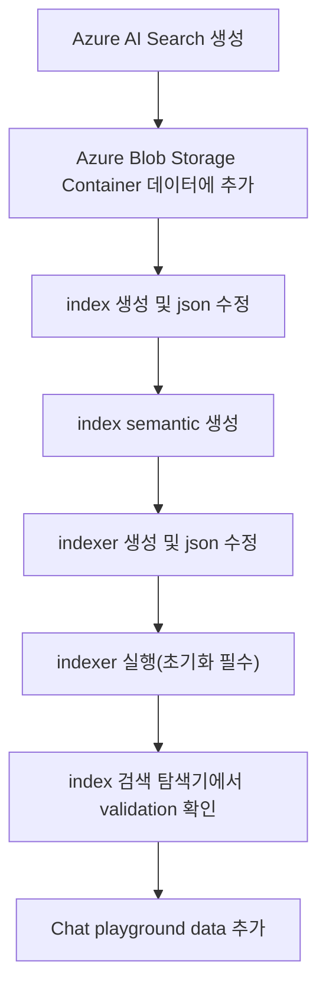
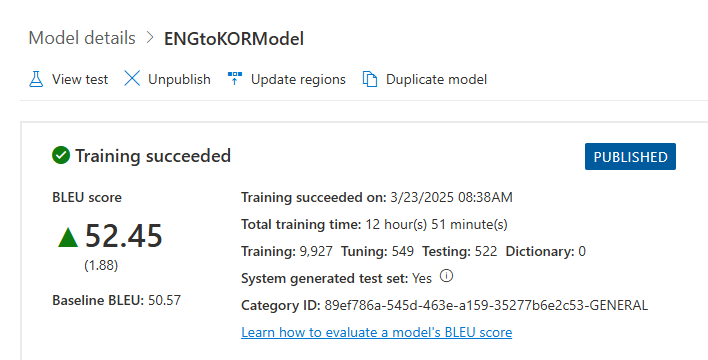
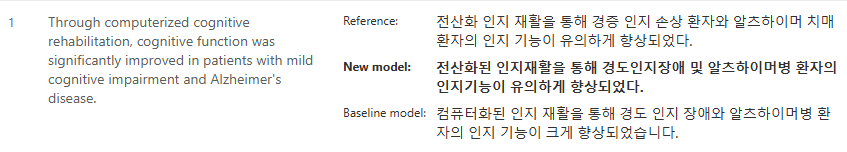
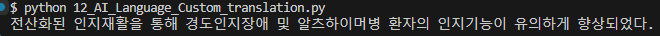
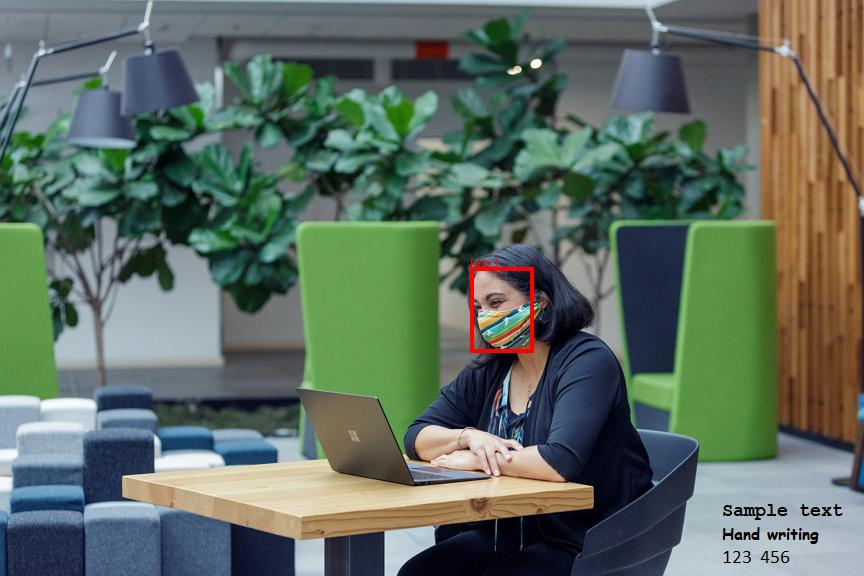
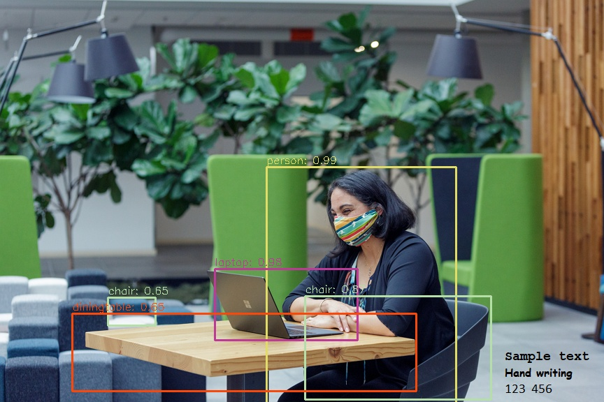
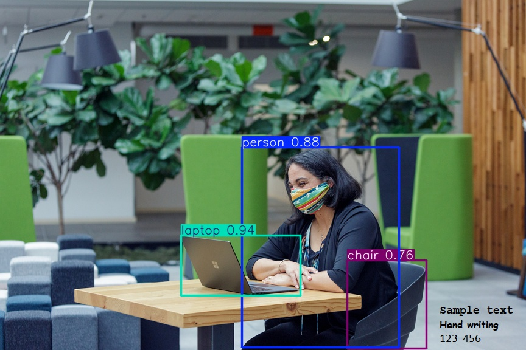

# Azure OpenAI & AI services

## API, Rest API, SDK
- API(Application Programming Interface) : 소프트웨어 간의 상호작용을 가능하게 하는 규칙과 도구의 집합  
- REST API(Representational Stable Tranfer API) : 웹에서 자원을 HTTP 방식으로 접근하고 조작할 수 있게 해주는 표준화된 인터페이스  
- SDK(Software Development Kit) : 특정 소프트웨어 패키지, 프레임워크, 하드웨어 플랫폼 등을 개발하기 위한 도구 모음  

## Azure OpenAI Service Chat Playground
git clone https://github.com/MicrosoftLearning/mslearn-openai.git  

```curl
payload="{\"messages\":[],\"temperature\":0.7,\"top_p\":0.95,\"max_tokens\":800}"
   curl "YOUR_ENDPOINT" \
  -H "Content-Type: application/json" \
  -H "api-key: YOUR_API_KEY" \
  -d "$payload"
  ```
  Postman을 이용해서 validation 체크  
  -H header   
  -d Body (json 형식으로 등록)  

## HTTP 상태코드   
> - 2XX (Sucessful) : 클라이언트 요청을 성공적으로 처리  
      200 OK : GET 요청이 성공한 경우  
      201 Created : POST 요청이 성공한 경우  
      202 Accepted : 요청이 접수되었으나 완료되지 않은 경우  
      204 No Content : 요청을 성공적으로 수행했지만, 응답 페이로드 본문에 보낼 데이터가 없는 경우  
> - 4XX (Client Error) : 클라이언트 오류, 잘못된 문법 등으로 서버가 요청을 수행할 수 없음  
      400 Bad Request : 클라이언트가 잘못된 요청을 해서 서버가 요청을 처리할 수 없는 경우  
      401 Unauthorized : 클라이언트가 해당 리소스에 대한 인증이 필요한 경우  
      403 Forbidden : 서버가 요청을 이해했지만 승인을 거부하는 경우  
      404 Not Found : 요청 리소스를 찾을 수 없는 경우  

## Azure OpenAI Service Chat Playground Extension
> **남해군 관광지 데이터**
> - travel-index.json : 필드 이름 생성
> - travel-indexer.json : travel-index 필드와 맵핑
> - 남해군 관광지현황.csv : 한글 csv 파일은 EUC-KR로 변경하여 확인 후 UTF-8 with BOM 으로 변경 필요


## AI Language  
git clone https://github.com/Azure/azure-sdk-for-python.git  

## AsyncIO  
> - 비동기 프로그래밍은 프로그램이 하나의 작업이 완료될 때까지 기다리지 않고, 동시에 여러 작업을 처리할 수 있도록 하는 프로그래밍 패러다임  
> - Python의 AsyncIO는 이러한 비동기 작업을 지원하기 위한 표준 라이브러리  
> - 주로 I/O 바운드(네트워크 요청, 파일 입출력 등) 작업에서 효율성을 극대화  
> - 프로그램의 응답성을 높이고, 리소스를 효율적으로 사용하게 함으로써 많은 동시 작업을 처리할 때 유리한 구조를 제공  
> - **async 키워드**는 파이썬에서 비동기 함수를 정의하기 위한 예약어  
> - python==3.12은 **pip install aiohttp==3.9.0rc0 설치필요**  

## AI Language CustomNER(Custom named entity recognition)
> 1. AI Language Azure Storage Blob Container에 ./data/LoanAgreements/ 모든 파일을 업로드  
> 2. AI Language Azure Storage Blob [엑세스 제어] - [추가] - [역할 할당 추가]  
> 3. Storage Blob 데이터 Contributor 검색 - [구성원] - [구성원 선택]  

## AI Language Single Label Classify
> - AI Language Azure Storage Blob Container에 ./data/WebOfScience/ 모든 파일을 업로드

## AI Language Custom Translator  
  
첨부된 ENGtoKOR.csv 파일을 .xml 파일로 변환하여 사용하길 권장  
BELU score 수치는 높다고 좋은건 아니고, 40 ~ 60으로 나와야 더 좋은 품질의 번역을 함  
Global endpoint에 배포한 모델의 Categoty ID만 제대로 연결하면 사용 가능  
  
  
이와 같이 모델에서 학습한 대로 정상적으로 출력함.

## AI Language CLU(Conversational Language Understanding)  
./data/EmailAppDemo.json 파일 업로드  

## Custom Vision vs Image Analysis 4.0
| 분야 | **Custom Vision Service** | **Image Analusis 4.0 Service** |
|:-----:|:---:|:----------:|
| 특징 | 내가 준비한 데이터셋에 최적화된 작은 모델 | 거대 사전학습을 활용한 zero-shot 추론가능 |
| Base 모델 | CNN(Convolutional Neural Networks) | Florence( Microsoft가 만든 멀티모달 대형 Vision Transformer 모델) |
| 학습 필요 여부 | 필요(수시간 소요) | 뷸필요(즉시 사용) |
| 정확도(특정 도메인) | 높음(적절한 훈련 필수) | 낮을 수 있음 |
| 정확도 (일반적 이미지) | 낮음 | 매우 높음 |

zero-shot : 기계 학습 모델이 얼마나 일반화되어 있는지, 그리고 얼마나 적은 데이터로도 새로운 과제를 해결할 수 있는지를 말해주는 핵심적인 개념  

## Yolo v3  
yolov3.cfg https://github.com/tianhai123/yolov3/blob/master/cfg/yolov3.cfg  
coco.names https://github.com/tianhai123/yolov3/blob/master/cfg/coco.names  
yolov3.weights https://pjreddie.com/media/files/yolov3.weights  
각 파일 다운로드 받아서 ./data/yolo3/ 해당 경로에 위치  

## Video Indexer  
https://learn.microsoft.com/ko-kr/azure/ai-services/computer-vision/how-to/video-retrieval  
./data/responsible_ai.mp4 동영상 파일을 Blob Container 업로드 후 SAS URL 생성 필요  

## 감지 출력 이미지  
|<b>Azure BackGroundRemoval</b>|
|:--:|
  
|<b>Azure FACE API</b>|
  
|<b>OpenCV Face Detect & Mosaic</b>|
  
|<b>Yolo v3 Face Detect</b>|
  
|<b>yolo v8 Face Detect</b>|
  
