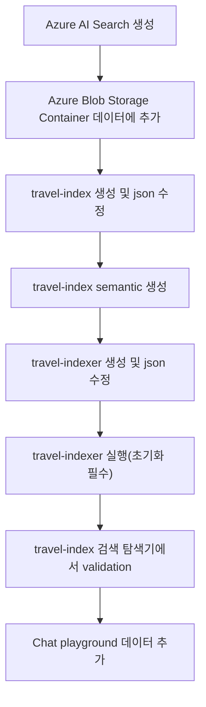

# Azure OpenAI

## API, Rest API, SDK
- API(Application Programming Interface) : 소프트웨어 간의 상호작용을 가능하게 하는 규칙과 도구의 집합  
- REST API(Representational Stable Tranfer API) : 웹에서 자원을 HTTP 방식으로 접근하고 조작할 수 있게 해주는 표준화된 인터페이스  
- SDK(Software Development Kit) : 특정 소프트웨어 패키지, 프레임워크, 하드웨어 플랫폼 등을 개발하기 위한 도구 모음  

## Azure OpenAI Service Chat Playground
git clone https://github.com/MicrosoftLearning/mslearn-openai.git  

```curl
payload="{\"messages\":[],\"temperature\":0.7,\"top_p\":0.95,\"max_tokens\":800}"
   curl "YOUR_ENDPOINT" \
  -H "Content-Type: application/json" \
  -H "api-key: YOUR_API_KEY" \
  -d "$payload"
  ```
  Postman을 이용해서 validation 체크
  -H header 
  -d Body (json 형식으로 등록)

## HTTP 상태코드  
> - 1XX (informational) : 요청이 수신되어 처리중  
> - 2XX (Sucessful) : 클라이언트 요청을 성공적으로 처리  
      200 OK : GET 요청이 성공한 경우  
      201 Created : POST 요청이 성공한 경우  
      202 Accepted : 요청이 접수되었으나 완료되지 않은 경우  
      204 No Content : 요청을 성공적으로 수행했지만, 응답 페이로드 본문에 보낼 데이터가 없는 경우  
> - 4XX (Client Error) : 클라이언트 오류, 잘못된 문법 등으로 서버가 요청을 수행할 수 없음  
      400 Bad Request : 클라이언트가 잘못된 요청을 해서 서버가 요청을 처리할 수 없는 경우  
      401 Unauthorized : 클라이언트가 해당 리소스에 대한 인증이 필요한 경우  
      403 Forbidden : 서버가 요청을 이해했지만 승인을 거부하는 경우  
      404 Not Found : 요청 리소스를 찾을 수 없는 경우  

## Azure OpenAI Service Chat Playground Extension
> **남해군 관광지 데이터**
> - travel-index.json :
> - travel-indexer.json :
> - 남해군 관광지현황.csv : 한글 csv 파일은 EUC-KR로 변경하여 확인 후 UTF-8 with BOM 으로 변경 필요
